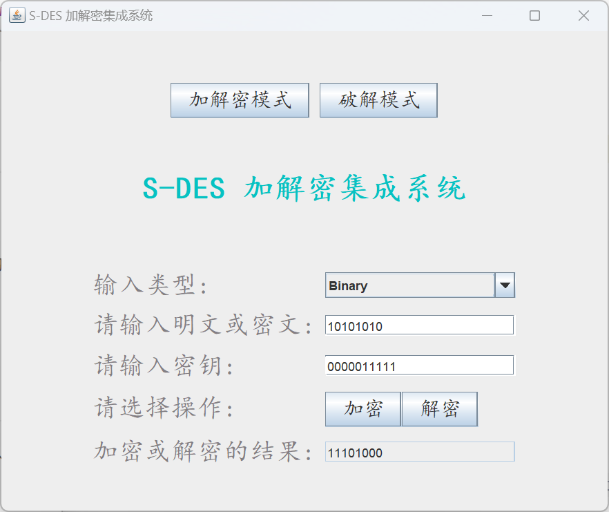
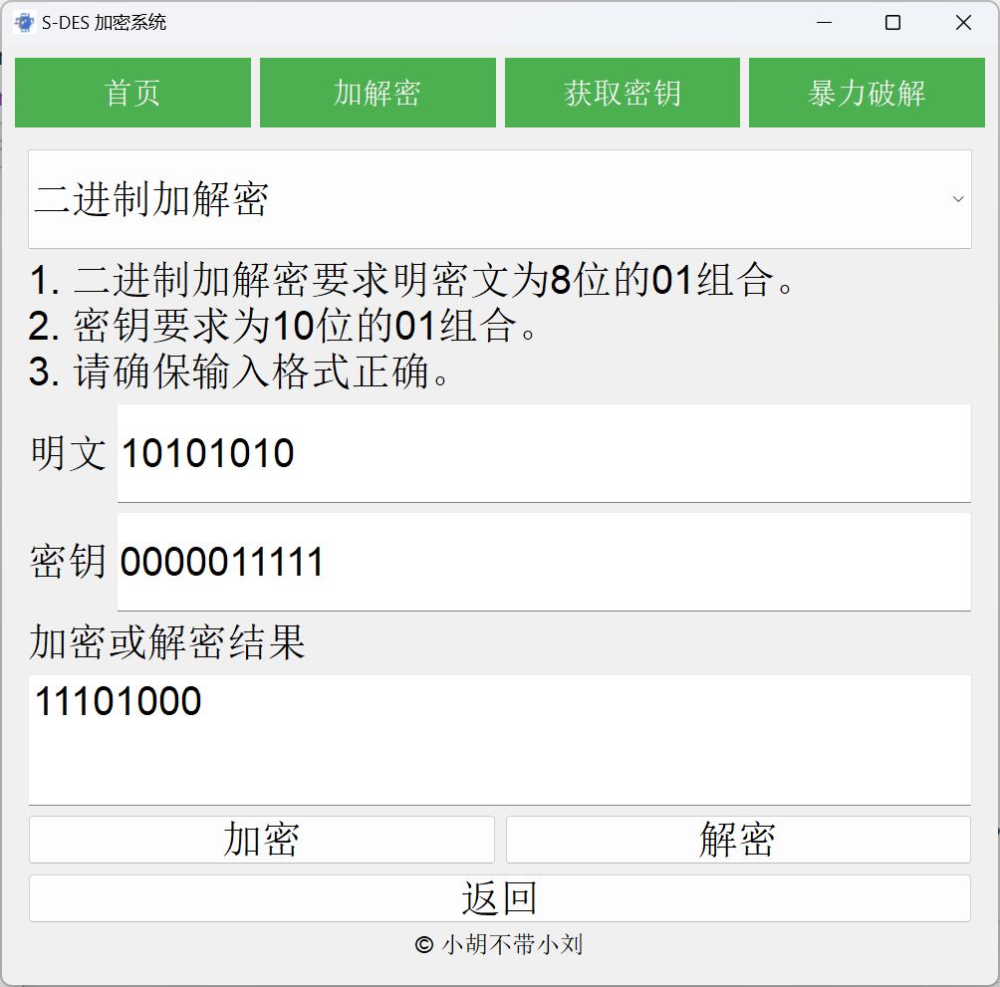
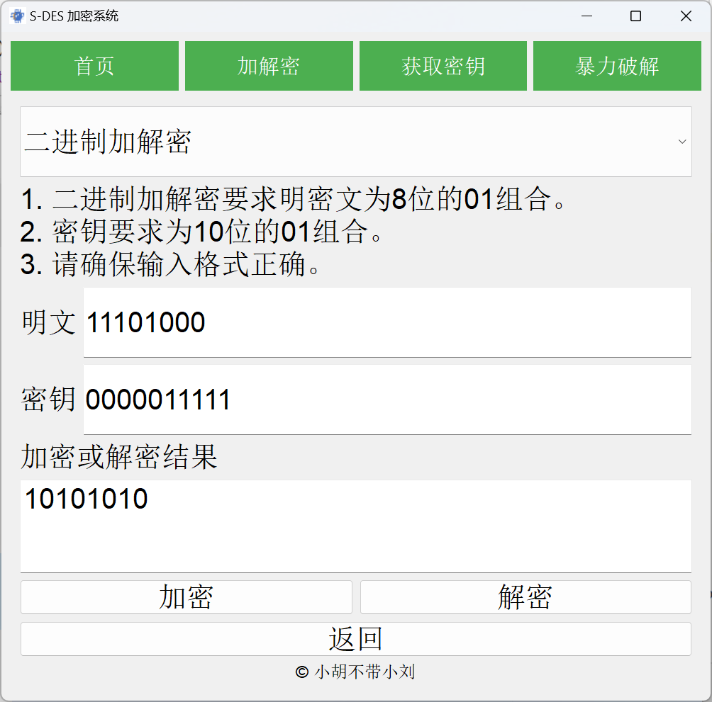
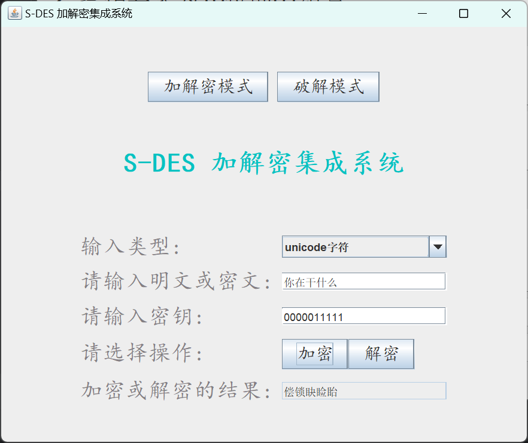
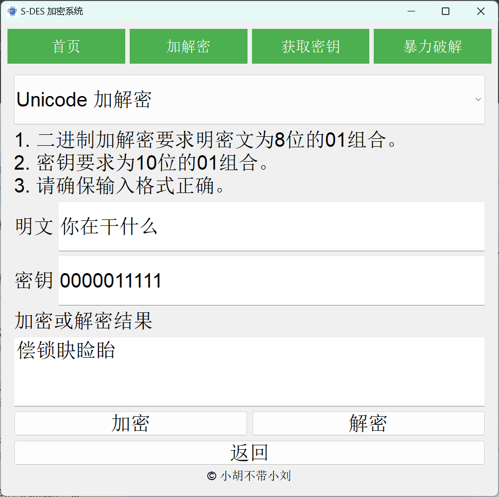

# 测试结果

## 第一关：基本测试

- 根据S-DES算法编写和调试程序，提供GUI解密支持用户交互。输入可以是8bit的数据和10bit的密钥，输出是8bit的密文。

**S-DES算法流程：**

- ***主界面***

可以选择不同的功能模块，包括：**加解密模式、暴力破解模式**

### 1、加密操作

- 测试密钥均为0000011111

- **二进制类型的加密**

  明文为10101010

  

**ASCII类型的加密**

明文为abcdefg

### 2、解密操作

- 测试密钥均为0000011111

- **二进制类型的解密**

密文为11101000

- **ASCII类型的解密**

## 第二关：交叉测试

- 考虑到是**算法标准**，所有人在编写程序的时候需要使用相同算法流程和转换单元(P-Box、S-Box等)，以保证算法和程序在异构的系统或平台上都可以正常运行。
- 设有A和B两组位同学(选择相同的密钥K)；则A、B组同学编写的程序对明文P进行加密得到相同的密文C；或者B组同学接收到A组程序加密的密文C，使用B组程序进行解密可得到与A相同的P。

- 我们与刘肖、胡力文组进行了交叉测试
- 选择相同的密钥K为：0000011111
- 相同的明文P为：10101010

同时，刘肖组使用我们组的加密结果使用密钥K进行解密，解密后的明文为：10101010。结果如下所示，说明我们所设计的算法是标准算法。

**二进制测试：**

**Unicode码测试：**

- 输入字符均为：你在干什么

- 加密结果均为：偿锁䀗睑眙

## 第三关：扩展功能

考虑到向实用性扩展，加密算法的数据输入可以是ASII编码字符串(分组为1 Byte)，对应地输出也可以是ACII字符串(很可能是乱码)。

我们扩展了对ASCII码和Unicode码的加解密算法。

- 当明文或者密文输入格式不符合标准输入格式时，都会视为拓展输入，此时将输入作为一个长为n的字符串，n为输入的长度。
- 将每一位字符先转化为8位的二进制ASCII码，再对8位二进制的ASCII码进行标准格式的加密，再将加密结果视作ASCII码然后转化为字符。
- 或将每一位字符先转化为16位的二进制Unicode码，再对16位二进制的Unicode码分组进行标准格式的加密，再将加密结果视作Unicode码然后转化为字符。
- 将每一位转化的结果进行组合，得到新的字符串即为密文。

**功能实现**

- GUI界面提供了ASCII或二进制编码或Unicode编码的按钮，选择可以切换加密模式，ASCII模式下输出密文为ASCII对应的字符串，Unicode模式下输出密文为Unicode对应的字符串。

- #### ASCII类型加解密模式

- **加密**

- **解密**

- #### Unicode类型加解密模式

- **加密**

- **解密**

  

## 第四关：暴力破解

- 假设你找到了使用相同密钥的明、密文对(一个或多个)，请尝试使用暴力破解的方法找到正确的密钥Key。在编写程序时，你也可以考虑使用多线程的方式提升破解的效率。请设定时间戳，用视频或动图展示你在多长时间内完成了暴力破解。

**暴力破解用户界面**：

- 用户输入已知明文和已知密文，点击开始破解，在一段时间后便可得到暴力破解的密钥。

## 第5关：封闭测试

- 根据第4关的结果，进一步分析，对于你随机选择的一个明密文对，是不是有不止一个密钥Key？进一步扩展，对应明文空间任意给定的明文分组P~~n~~，是否会出现选择不同的密钥K~~i~~ ≠ K~~j~~加密得到相同密文C~~n~~的情况？

| 明文     |   密文   | 加密使用的密钥 | 破解的密钥 | 破解时间 |
| -------- | :------: | :------------: | :--------: | :------: |
| 10101010 | 11101000 |   0000011111   | 0000011111 | 2.7046ms |
|          |          |                | 0100011111 |          |
|          |          |                | 1011001011 |          |
|          |          |                | 1111001011 |          |
| 11110000 | 11101110 |   0101010101   | 0001010101 | 1.9388ms |
|          |          |                | 0010001100 |          |
|          |          |                | 0101010101 |          |
|          |          |                | 0110001100 |          |
| 10010010 | 11001011 |   0101010101   | 0001010101 | 4.6399ms |
|          |          |                | 0010101100 |          |
|          |          |                | 0101010101 |          |
|          |          |                | 0110101100 |          |
|          |          |                | 1010111010 |          |
|          |          |                | 1110111010 |          |
| 00110011 | 10001100 |   0100011111   | 0000011111 | 4.2784ms |
|          |          |                | 0100011111 |          |
|          |          |                | 1001110000 |          |
|          |          |                | 1010001001 |          |
|          |          |                | 1101110000 |          |
|          |          |                | 1110001001 |          |

- 由分析结果来看，对于随机选择的一个明密文对，有不止一个密钥Key。进一步发现，对同一明文使用不同密钥进行加密，可能会得到相同的密文。
- 即：对于明文空间内任意给定的明文分组，确实存在可能性，即选择不同的密钥，加密可以得到相同的密文，如下所示。

- 明文在测试1中选择10101010，密钥选择0000011111，密文为11101000
- 之后我们选择密钥0100011111，明文不变，加密的密文仍为11101000

# 总结

- S-DES的密钥空间只有10-bit，共1024种情况，这样的密码系统显然安全性不足

- S-DES中的置换盒，替换盒，轮函数和移位都展现了密码学的精华，即扩散和混淆，通过这一系列的变化能够很好地抹去明文和密文的统计特征，密文和密钥的统计关系

  

